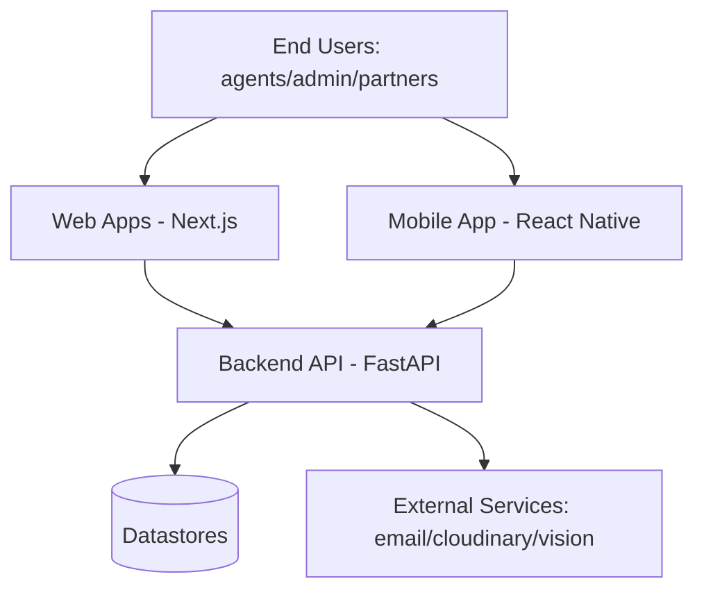

# Architecture Baseline (C4-lite)

## Context
CRMPLUSV7 is a multi-application CRM ecosystem with:
- Backend API (Python/FastAPI)
- Web apps (Next.js): backoffice, web, site-montra, super-admin
- Mobile app (React Native/Expo)

## Containers
- `backend/`: API, business services, auth, persistence integration.
- `backoffice/`: internal operational UI.
- `super-admin/`: administrative control UI.
- `web/` and `site-montra/`: web-facing interfaces.
- `mobile/app/`: mobile client.

## Components (high-level)
- AuthN/AuthZ
- CRM domain services (leads/clients/properties/visits)
- Media and document workflows
- Integrations (email, cloud storage, OCR)

## Tenancy and Isolation (Baseline)
Repository evidence indicates multi-tenant concerns.
Minimum expected controls:
- Tenant-scoped authorization in API paths and queries.
- Strict data partitioning at persistence layer (app-level guardrails and/or DB-enforced controls such as RLS where available).
- Tenant identifier propagation through service boundaries and logs.
- Regression tests for cross-tenant access denial.

## Compliance Note
This document is a baseline architecture snapshot for due diligence and IP review; it does not replace deeper technical specifications.
